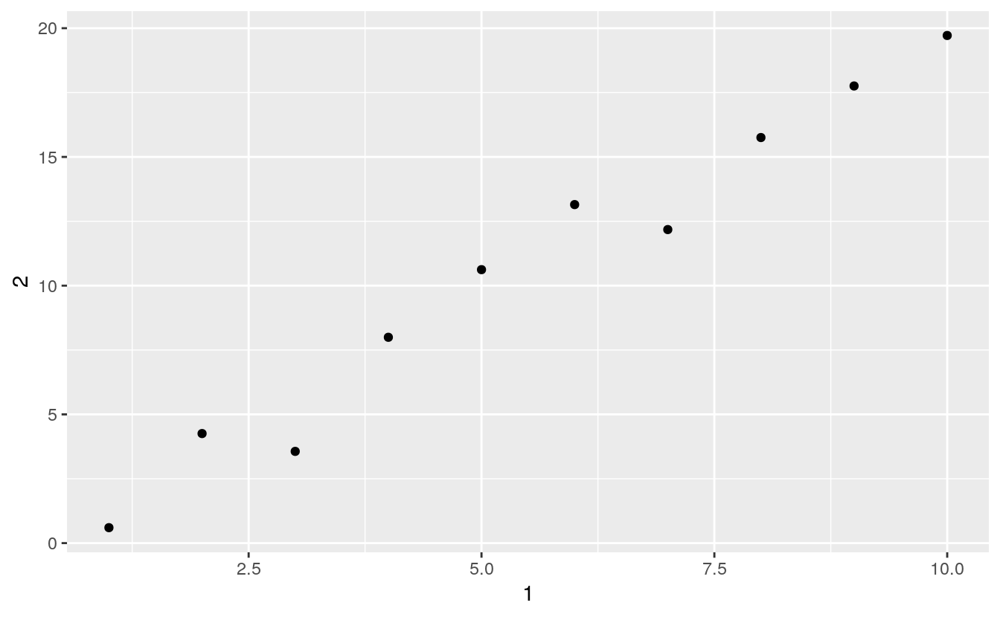

# Tibbles


## 10.5 Ejercicios{-#ejercicios-105}

1. ¿Cómo puedes saber si un objeto es un tibble? (Sugerencia: imprime `mtautos` en la consola, que es un data frame clásico).

<div class="solucion">
<h3>Solución</h3>
Los objetos que son tibbles lo indican cuando se imprimen en la consola. Por ejemplo, `vuelos` es un tibble:

```r
vuelos
#> # A tibble: 336,776 x 19
#>    anio   mes   dia horario_salida salida_programa… atraso_salida
#>   <int> <int> <int>          <int>            <int>         <dbl>
#> 1  2013     1     1            517              515             2
#> 2  2013     1     1            533              529             4
#> 3  2013     1     1            542              540             2
#> 4  2013     1     1            544              545            -1
#> 5  2013     1     1            554              600            -6
#> 6  2013     1     1            554              558            -4
#> # … with 336,770 more rows, and 13 more variables: horario_llegada <int>,
#> #   llegada_programada <int>, atraso_llegada <dbl>, aerolinea <chr>,
#> #   vuelo <int>, codigo_cola <chr>, origen <chr>, destino <chr>,
#> #   tiempo_vuelo <dbl>, distancia <dbl>, hora <dbl>, minuto <dbl>,
#> #   fecha_hora <dttm>
```

`mtautos`, en cambio, es un data frame clásico:


```r
mtautos
#>                     millas cilindros cilindrada caballos  eje peso velocidad
#> Mazda RX4             21.0         6      160.0      110 3.90 2.62      16.5
#> Mazda RX4 Wag         21.0         6      160.0      110 3.90 2.88      17.0
#> Datsun 710            22.8         4      108.0       93 3.85 2.32      18.6
#> Hornet 4 Drive        21.4         6      258.0      110 3.08 3.21      19.4
#> Hornet Sportabout     18.7         8      360.0      175 3.15 3.44      17.0
#> Valiant               18.1         6      225.0      105 2.76 3.46      20.2
#> Duster 360            14.3         8      360.0      245 3.21 3.57      15.8
#> Merc 240D             24.4         4      146.7       62 3.69 3.19      20.0
#> Merc 230              22.8         4      140.8       95 3.92 3.15      22.9
#> Merc 280              19.2         6      167.6      123 3.92 3.44      18.3
#> Merc 280C             17.8         6      167.6      123 3.92 3.44      18.9
#> Merc 450SE            16.4         8      275.8      180 3.07 4.07      17.4
#> Merc 450SL            17.3         8      275.8      180 3.07 3.73      17.6
#> Merc 450SLC           15.2         8      275.8      180 3.07 3.78      18.0
#> Cadillac Fleetwood    10.4         8      472.0      205 2.93 5.25      18.0
#> Lincoln Continental   10.4         8      460.0      215 3.00 5.42      17.8
#> Chrysler Imperial     14.7         8      440.0      230 3.23 5.34      17.4
#> Fiat 128              32.4         4       78.7       66 4.08 2.20      19.5
#> Honda Civic           30.4         4       75.7       52 4.93 1.61      18.5
#> Toyota Corolla        33.9         4       71.1       65 4.22 1.83      19.9
#> Toyota Corona         21.5         4      120.1       97 3.70 2.46      20.0
#> Dodge Challenger      15.5         8      318.0      150 2.76 3.52      16.9
#> AMC Javelin           15.2         8      304.0      150 3.15 3.44      17.3
#> Camaro Z28            13.3         8      350.0      245 3.73 3.84      15.4
#> Pontiac Firebird      19.2         8      400.0      175 3.08 3.85      17.1
#> Fiat X1-9             27.3         4       79.0       66 4.08 1.94      18.9
#> Porsche 914-2         26.0         4      120.3       91 4.43 2.14      16.7
#> Lotus Europa          30.4         4       95.1      113 3.77 1.51      16.9
#> Ford Pantera L        15.8         8      351.0      264 4.22 3.17      14.5
#> Ferrari Dino          19.7         6      145.0      175 3.62 2.77      15.5
#> Maserati Bora         15.0         8      301.0      335 3.54 3.57      14.6
#> Volvo 142E            21.4         4      121.0      109 4.11 2.78      18.6
#>                     forma transmision cambios carburadores
#> Mazda RX4               0           1       4            4
#> Mazda RX4 Wag           0           1       4            4
#> Datsun 710              1           1       4            1
#> Hornet 4 Drive          1           0       3            1
#> Hornet Sportabout       0           0       3            2
#> Valiant                 1           0       3            1
#> Duster 360              0           0       3            4
#> Merc 240D               1           0       4            2
#> Merc 230                1           0       4            2
#> Merc 280                1           0       4            4
#> Merc 280C               1           0       4            4
#> Merc 450SE              0           0       3            3
#> Merc 450SL              0           0       3            3
#> Merc 450SLC             0           0       3            3
#> Cadillac Fleetwood      0           0       3            4
#> Lincoln Continental     0           0       3            4
#> Chrysler Imperial       0           0       3            4
#> Fiat 128                1           1       4            1
#> Honda Civic             1           1       4            2
#> Toyota Corolla          1           1       4            1
#> Toyota Corona           1           0       3            1
#> Dodge Challenger        0           0       3            2
#> AMC Javelin             0           0       3            2
#> Camaro Z28              0           0       3            4
#> Pontiac Firebird        0           0       3            2
#> Fiat X1-9               1           1       4            1
#> Porsche 914-2           0           1       5            2
#> Lotus Europa            1           1       5            2
#> Ford Pantera L          0           1       5            4
#> Ferrari Dino            0           1       5            6
#> Maserati Bora           0           1       5            8
#> Volvo 142E              1           1       4            2
```

También se puede utilizar la función `is_tibble()` para comprobar si un objeto lo es:


```r
is_tibble(vuelos)
#> [1] TRUE
is_tibble(mtautos)
#> [1] FALSE
```

</div>

2. Compara y contrasta las siguientes operaciones aplicadas a un `data.frame` y a un tibble equivalente. ¿Qué es diferente? ¿Por qué podría causarte problemas el comportamiento por defecto del data frame?


```r
df <- data.frame(abc = 1, xyz = "a")
df$x
df[, "xyz"]
df[, c("abc", "xyz")]
```

<div class="solucion">
<h3>Solución</h3>


```r
df <- data.frame(abc = 1, xyz = "a")
df$x
#> [1] a
#> Levels: a
df[, "xyz"]
#> [1] a
#> Levels: a
df[, c("abc", "xyz")]
#>   abc xyz
#> 1   1   a
```

Ahora, convirtamos `df` en un tibble: 

```r
tbl <- as_tibble(df)
```

Y apliquemos las mismas operaciones:

```r
df$x
#> [1] a
#> Levels: a
df[, "xyz"]
#> [1] a
#> Levels: a
df[, c("abc", "xyz")]
#>   abc xyz
#> 1   1   a
```


</div>

3. Si tienes el nombre de una variable guardada en un objeto, p.e., `var <- "horario_salida"`, ¿cómo puedes extraer esta variable de un tibble?

<div class="solucion">
<h3>Solución</h3>

Para exatraerla como tibble:

```r
vuelos[,var]
```

Para extraer los valores

```r
vuelos[[var]]
```

</div>

4. Practica referenciar nombres no sintácticos en el siguiente data frame:


```r
molesto <- tibble(
  `1` = 1:10,
  `2` = `1` * 2 + rnorm(length(`1`))
)
```

 1. Extrayendo la variable llamada `1`.


```r
molesto$`1`
#>  [1]  1  2  3  4  5  6  7  8  9 10
```
o

```r
molesto[["1"]]
#>  [1]  1  2  3  4  5  6  7  8  9 10
```


 2. Generando un gráfico de dispersión de `1` vs `2`.


```r
ggplot(molesto, aes(x = `1`, y = `2`)) + geom_point()
```




 3. Creando una nueva columna llamada `3` que sea el resultado de la división de `2` por `1`.


```r
molesto <- mutate(molesto, `3` = `2` / `1`)
```

 4. Renombrando las columnas como `uno`, `dos` y `tres`.


```r
rename(molesto, uno = `1`, dos = `2`, tres = `3`)
#> # A tibble: 10 x 3
#>     uno    dos  tres
#>   <int>  <dbl> <dbl>
#> 1     1  0.600 0.600
#> 2     2  4.26  2.13 
#> 3     3  3.56  1.19 
#> 4     4  7.99  2.00 
#> 5     5 10.6   2.12 
#> 6     6 13.1   2.19 
#> # … with 4 more rows
```


5. ¿Qué hace `tibble::enframe()`? ¿Cuándo lo usarías?

<div class="solucion">
<h3>Solución</h3>
La función `enframe()` del paquete __tibble__ permite convertir vectores nombrados o listas en _data frames_ de una o dos columnas. Las columnas creadas tienen por nombre `name` (nombres) y `value` (valor).


```r
enframe(c(a = 5, b = 7, c = 9, d = 11))
#> # A tibble: 4 x 2
#>   name  value
#>   <chr> <dbl>
#> 1 a         5
#> 2 b         7
#> 3 c         9
#> 4 d        11
```

</div>

6. ¿Qué opción controla cuántos nombres de columnas adicionales se muestran al pie de un tibble?

<div class="solucion">
<h3>Solución</h3>
A través del argumento `n_extra` se puede controlar cuántas columnas adicionales mostrar.


```r
print(vuelos, n_extra = 3)
#> # A tibble: 336,776 x 19
#>    anio   mes   dia horario_salida salida_programa… atraso_salida
#>   <int> <int> <int>          <int>            <int>         <dbl>
#> 1  2013     1     1            517              515             2
#> 2  2013     1     1            533              529             4
#> 3  2013     1     1            542              540             2
#> 4  2013     1     1            544              545            -1
#> 5  2013     1     1            554              600            -6
#> 6  2013     1     1            554              558            -4
#> # … with 336,770 more rows, and 13 more variables: horario_llegada <int>,
#> #   llegada_programada <int>, atraso_llegada <dbl>, …
```

En este [enlace](https://tibble.tidyverse.org/reference/formatting.html) puedes ver más información sobre las opciones para imprimir tibbles.

</div>
