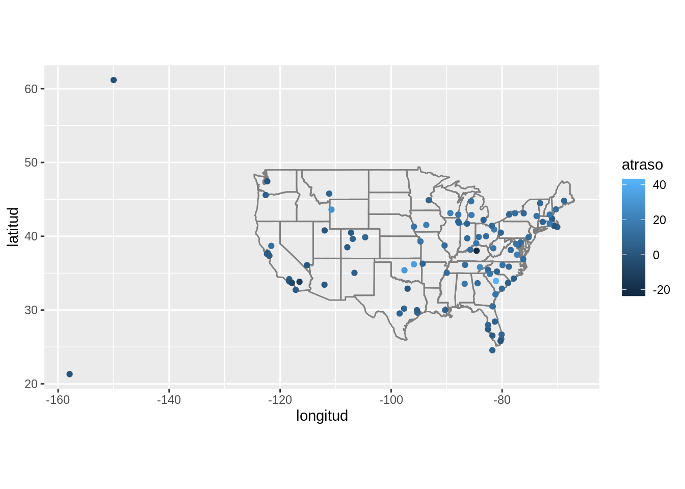
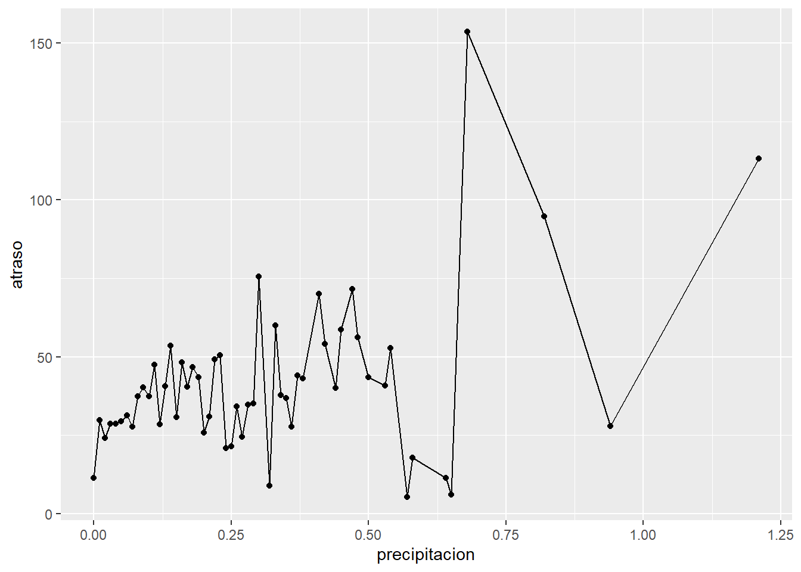
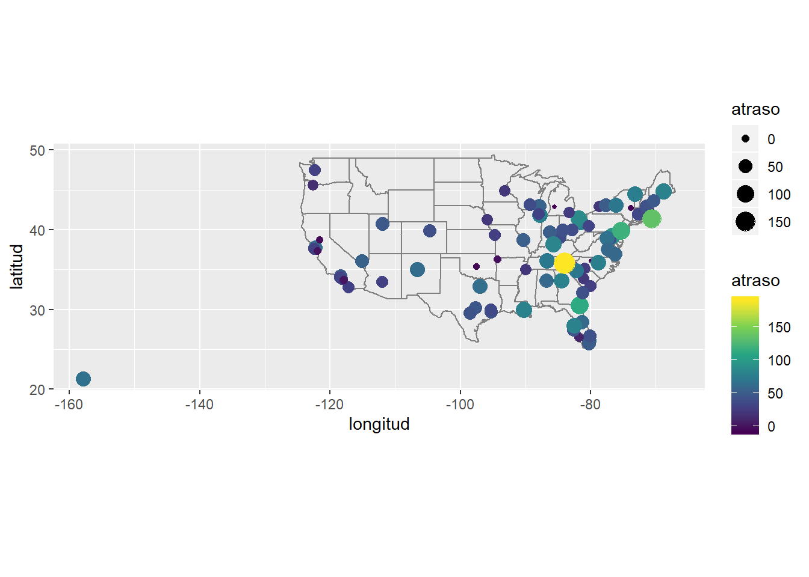
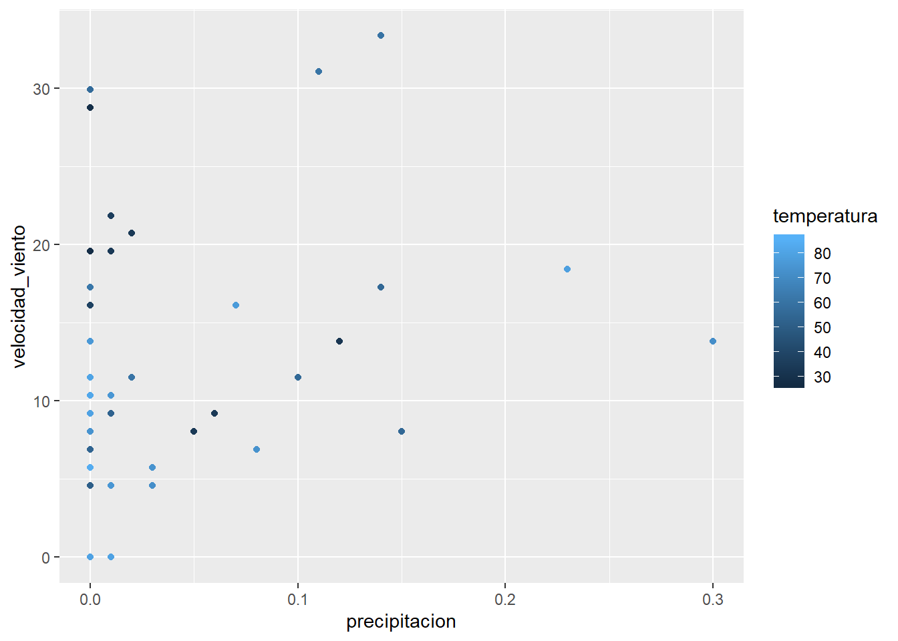

# Datos relacionales


## 13.2 Datos sobre vuelos {-#vuelos-relacionales}

### 13.2.1 Ejercicios{-#ejercicios-1321}

1. Imagina que necesitas dibujar (aproximadamente) la ruta que cada avión vuela 
 desde su origen hasta el destino. ¿Qué variables necesitas? ¿Qué tablas
 necesitas combinar?

<div class="solucion">
<h3>Solución</h3>

Necesitas combinar `aeropuertos` con `vuelos` ya que el dataset `aeropuertos` 
contiene las coordenadas de los aeropuertos. Puedes unir las tablas por medio
de la variable `codigo_aeropuerto` en `aeropuertos` y `origen` y `destino` en
`vuelos`.


</div>

2. Olvidamos incluir la relación entre `clima` y `aeropuertos`. ¿Cuál es la
 relación y cómo debe aparecer en el diagrama?

<div class="solucion">
<h3>Solución</h3>

De manera similar al ejercicio anterior, se pueden unir mediante
`codigo_aeropuerto` en `aeropuertos` y `origen` en `clima`.
</div>

3. `clima` únicamente contiene información de los aeropuertos de origen 
 (Nueva York). Si contuviera registros para todos los aeropuertos de EEUU, ¿Qué
 relación tendría con `vuelos`?

<div class="solucion">
<h3>Solución</h3>

Puedes conectar `clima` con `vuelos` usando la columna `destino` e incluir el
clima de los aeropuertos de EEUU que están presentes en la tabla `vuelos`.
</div>

4. Sabemos que hay días "especiales" en el año y pocas personas vuelan esos
 días. ¿Cómo se representarían en un data frame? ¿Cuáles serían las claves
 primarias de esa tabla? ¿Cómo se conectaría con las tablas existentes?
   
<div class="solucion">
<h3>Solución</h3>

Una posibilidad es contar con un dataset de los días festivos en EEUU indicando
mes y día. Esta información se puede unir con cada vuelo en la tabla `vuelos` y
y a la vez con el dataset `clima`.
</div>

## 13.3 Claves{-#claves}

### 13.3.1 Ejercicios{-#ejercicios-1331}

1. Agrega una clave subrogada a `vuelos`.

<div class="solucion">
<h3>Solución</h3>


```r
vuelos %>%
  mutate(id = row_number(anio)) %>%
  select(id, everything())
#> # A tibble: 336,776 x 20
#>      id  anio   mes   dia horario_salida salida_programa… atraso_salida
#>   <int> <int> <int> <int>          <int>            <int>         <dbl>
#> 1     1  2013     1     1            517              515             2
#> 2     2  2013     1     1            533              529             4
#> 3     3  2013     1     1            542              540             2
#> 4     4  2013     1     1            544              545            -1
#> 5     5  2013     1     1            554              600            -6
#> 6     6  2013     1     1            554              558            -4
#> # … with 336,770 more rows, and 13 more variables: horario_llegada <int>,
#> #   llegada_programada <int>, atraso_llegada <dbl>, aerolinea <chr>,
#> #   vuelo <int>, codigo_cola <chr>, origen <chr>, destino <chr>,
#> #   tiempo_vuelo <dbl>, distancia <dbl>, hora <dbl>, minuto <dbl>,
#> #   fecha_hora <dttm>
```
</div>

2. Identifica las claves en los siguientes conjuntos de datos

 1. `datos::bateadores`
 1. `datos::nombres`
 1. `datos::atmosfera`
 1. `datos::vehiculos`
 1. `datos::diamantes`
  
 (Puede que necesites leer un poco de documentación.)

<div class="solucion">
<h3>Solución</h3>

 1. En `datos::bateadores` corresponde a `id_jugador`.
 1. En `datos::nombres` corresponde a la combinación de `anio` y `nombre`,
  con esto se puede unir cada par año-nombre con las otras tablas.
 1. En `datos::atmosfera` corresponde a  latitud`, `longitud`, `anio` y `mes`,
  lo cual identifica de manera única un lugar en el tiempo.
 1. En `datos::vehiculos` corresponde a `id`.
 1. En `datos::diamantes` no hay claves ya que estas tienen sentido en datos
 relacionales, es decir cuando existen otras tablas para combinar información.
</div>

2. Dibuja un diagrama que ilustre las conexiones entre las tablas `bateadores`,
  `personas` y `salarios` en el paquete datos. Dibuja otro diagrama que muestre la
  relación entre `personas`, `dirigentes` y `premios_dirigentes`.

  ¿Cómo caracterizarías las relación entre `bateadores`, `lanzadores` y `jardineros`?

<div class="solucion">
<h3>Solución</h3>

Es directo. Las tres tablas contienen los campos `id_jugador` y `anio` y cada
tabla contiene información que complementa las demás. La relación es uno a uno.
</div>

## 13.4 Uniones de transformación {#mutating-joins}

### 13.4.6 Ejercicios{-#ejercicios-1346}

1. Calcula el atraso promedio por destino, luego une los datos en `aeropuertos` 
   para que puedas mostrar la distribución espacial de los atrasos. Te presentamos 
   una forma fácil de dibujar un mapa de los Estados Unidos:

 
 ```r
 aeropuertos %>%
  semi_join(vuelos, c("codigo_aeropuerto" = "destino")) %>%
  ggplot(aes(longitud, latitud)) +
  borders("state") +
  geom_point() +
  coord_quickmap()
 ```

  (No te preocupes si no entiendes que hace `semi_join()`. 
  Lo aprenderás a continuación.)
  
  Quizás quieras usar `size` o `colour` para editar los puntos y mostrar 
  el atraso promedio de cada aeropuerto.
  
<div class="solucion">
<h3>Solución</h3>

```r
atraso_promedio_destino <- vuelos %>%
   group_by(destino) %>%
   # los vuelos con NA en atraso_llegada son vuelos cancelados
   summarise(atraso = mean(atraso_llegada, na.rm = TRUE)) %>%
   inner_join(aeropuertos, by = c(destino = "codigo_aeropuerto"))
#> `summarise()` ungrouping output (override with `.groups` argument)
```


```r
atraso_promedio_destino %>%
  ggplot(aes(longitud, latitud, colour = atraso)) +
  borders("state") +
  geom_point() +
  coord_quickmap()
```


</div>
 
2. Agrega la ubicación de origen _y_ destino (e.g. `latitud` y `longitud`) 
   a `vuelos`.

<div class="solucion">
<h3>Solución</h3>

Es posible realizar varias uniones. Si hay variables duplicadas, dplyr va a
distinguirlas agregando `.x` y `.y` al nombre de la variable para resolver
los nombres duplicados.


```r
ubicacion_aeropuertos <- aeropuertos %>%
  select(codigo_aeropuerto, latitud, longitud)

vuelos %>%
  select(anio:dia, hora, origen, destino) %>%
  left_join(
    ubicacion_aeropuertos,
    by = c("origen" = "codigo_aeropuerto")
  ) %>%
  left_join(
    ubicacion_aeropuertos,
    by = c("destino" = "codigo_aeropuerto")
  )
#> # A tibble: 336,776 x 10
#>    anio   mes   dia  hora origen destino latitud.x longitud.x latitud.y
#>   <int> <int> <int> <dbl> <chr>  <chr>       <dbl>      <dbl>     <dbl>
#> 1  2013     1     1     5 EWR    IAH          40.7      -74.2      30.0
#> 2  2013     1     1     5 LGA    IAH          40.8      -73.9      30.0
#> 3  2013     1     1     5 JFK    MIA          40.6      -73.8      25.8
#> 4  2013     1     1     5 JFK    BQN          40.6      -73.8      NA  
#> 5  2013     1     1     6 LGA    ATL          40.8      -73.9      33.6
#> 6  2013     1     1     5 EWR    ORD          40.7      -74.2      42.0
#> # … with 336,770 more rows, and 1 more variable: longitud.y <dbl>
```

Es una buena práctica tener nombres indicativos para las variables. Usaremos
el sufijo `_destino` y `_origen` para especificar a qué aeropuerto nos referimos.


```r
vuelos %>%
  select(anio:dia, hora, origen, destino) %>%
  left_join(
    ubicacion_aeropuertos,
    by = c("origen" = "codigo_aeropuerto")
  ) %>%
  left_join(
    ubicacion_aeropuertos,
    by = c("destino" = "codigo_aeropuerto"),
    suffix = c("_origen", "_destino")
  )
#> # A tibble: 336,776 x 10
#>    anio   mes   dia  hora origen destino latitud_origen longitud_origen
#>   <int> <int> <int> <dbl> <chr>  <chr>            <dbl>           <dbl>
#> 1  2013     1     1     5 EWR    IAH               40.7           -74.2
#> 2  2013     1     1     5 LGA    IAH               40.8           -73.9
#> 3  2013     1     1     5 JFK    MIA               40.6           -73.8
#> 4  2013     1     1     5 JFK    BQN               40.6           -73.8
#> 5  2013     1     1     6 LGA    ATL               40.8           -73.9
#> 6  2013     1     1     5 EWR    ORD               40.7           -74.2
#> # … with 336,770 more rows, and 2 more variables: latitud_destino <dbl>,
#> #   longitud_destino <dbl>
```
</div>

3. ¿Existe una relación entre la antiguedad de un avión y sus atrasos?

<div class="solucion">
<h3>Solución</h3>

Ya que no se indica si se refiere a atrasos de salida o llegada, se explorará
el atraso en la salida, quedando el otro caso como ejercicio.

Para comparar la antiguedad de un avión con sus atrasos, hay que unir
`vuelos` con `aviones`, esta última tabla contiene la variable `anio` que se
refiere al año de fabricación del avión.

Dado que hay pocos aviones de más de 25 años, truncaremos los datos y luego
vamos a calcular el promedio de llegada y salida dada la antiguedad.


```r
atrasos_por_antiguedad <- inner_join(vuelos,
   select(aviones, codigo_cola, anio_fabricacion = anio), by = "codigo_cola") %>%
   mutate(antiguedad = anio - anio_fabricacion) %>%
   filter(!is.na(antiguedad)) %>%
   mutate(antiguedad = if_else(antiguedad > 25, 25L, antiguedad)) %>%
   group_by(antiguedad) %>%
   summarise(
      prom_atraso_salida = mean(atraso_salida, na.rm = TRUE),
      desv_est_atraso_salida = sd(atraso_salida, na.rm = TRUE),
      nro_vuelos_atrasados_salida = sum(!is.na(atraso_salida))
   )
#> `summarise()` ungrouping output (override with `.groups` argument)
```

Ahora podemos explorar la reglación entre los atrasos en la salida y la
antiguedad.

El atraso en la salida es creciente en relación a la antiguedad para los
aviones de hasta de 10 años. Luego este atraso decae.

La reducción de los atrasos en la salida en relación a la antiguedad puede
deberse a que en los aviones más antiguos se planfica la mantención para evitar
tales atrasos y desperfectos mecánicos.


```r
ggplot(atrasos_por_antiguedad, aes(x = antiguedad, y = prom_atraso_salida)) +
  geom_point() +
  scale_x_continuous("Antiguedad del avión (años)", breaks = seq(0, 30, by = 10)) +
  scale_y_continuous("Atraso promedio en la salida (minutos)")
```


</div>

4. ¿Qué condiciones climáticas hacen más probables los atrasos?

<div class="solucion">
<h3>Solución</h3>

Las lluvias están asociadas con los atrasos. Sin embargo, para un nivel 
mayor a 0.02 pulgadas de lluvia no hay una tendencia fuerte.


```r
vuelo_clima <- vuelos %>%
  inner_join(clima, by = c(
    "origen",
    "anio",
    "mes",
    "dia",
    "hora"
  ))

vuelo_clima %>%
  group_by(precipitacion) %>%
  summarise(atraso = mean(atraso_salida, na.rm = TRUE)) %>%
  ggplot(aes(x = precipitacion, y = atraso)) +
  geom_line() +
  geom_point()
#> `summarise()` ungrouping output (override with `.groups` argument)
```


</div>

5. ¿Qué sucedió el día 13 de junio de 2013? Muestra el patrón espacial de los atrasos, 
   luego usa un buscador para encontrar referencias cruzadas con el clima.


<div class="solucion">
<h3>Solución</h3>

Hubo una serie de tormentas en el sureste de los EEUU (consulta la [Wikipedia](https://en.wikipedia.org/wiki/June_12%E2%80%9313,_2013_derecho_series)).

El siguiente gráfico muestra que los mayores atrasos se presentaron en
Tennessee (Nashville), el sureste y medio oeste es donde ocurrieron las
tormentas.


```r
vuelos %>%
  filter(anio == 2013, mes == 6, dia == 13) %>%
  group_by(destino) %>%
  summarise(atraso = mean(atraso_salida, na.rm = TRUE)) %>%
  inner_join(aeropuertos, by = c("destino" = "codigo_aeropuerto")) %>%
  ggplot(aes(y = latitud, x = longitud, size = atraso, colour = atraso)) +
  borders("state") +
  geom_point() +
  coord_quickmap() +
  scale_colour_viridis_c()
#> `summarise()` ungrouping output (override with `.groups` argument)
#> Warning: Removed 3 rows containing missing values (geom_point).
```


</div>

## 13.5 Uniones de filtro {#filtering-joins}

### 13.5.1 Ejercicios{-#ejercicios-1351}

1. ¿Qué significa que un vuelo no tenga `codigo_cola`? ¿Qué tienen en común los códigos 
   de cola que no tienen registros coincidentes en `aviones`? (Pista: Una variable explica 
   ~90% de los problemas.)

<div class="solucion">
<h3>Solución</h3>

Los vuelos que no registran código cola tampoco registran hora de llegada, por
lo que son vuelos cancelados.


```r
vuelos %>%
  filter(is.na(codigo_cola), !is.na(horario_llegada)) %>%
  nrow()
#> [1] 0
```

Muchos de los vuelos sin código cola en `aviones` pertenecen a
American Airlines (AA) o Envoy Airlines (EQ) como se detalla en la documentación.


```r
vuelos %>%
  anti_join(aviones, by = "codigo_cola") %>%
  count(aerolinea, sort = TRUE) %>%
  mutate(p = n / sum(n))
#> # A tibble: 10 x 3
#>   aerolinea     n      p
#>   <chr>     <int>  <dbl>
#> 1 MQ        25397 0.483 
#> 2 AA        22558 0.429 
#> 3 UA         1693 0.0322
#> 4 9E         1044 0.0198
#> 5 B6          830 0.0158
#> 6 US          699 0.0133
#> # … with 4 more rows
```

Sin embargo, no todos los códigos que aparecen en `vuelos` están perdidos en
`aviones`.


```r
vuelos %>%
  distinct(aerolinea, codigo_cola) %>%
  left_join(aviones, by = "codigo_cola") %>%
  group_by(aerolinea) %>%
  summarise(total_aviones = n(),
            faltan_en_aviones = sum(is.na(modelo))) %>%
  mutate(porcentaje_perdidos = faltan_en_aviones / total_aviones) %>%
  arrange(desc(porcentaje_perdidos))
#> `summarise()` ungrouping output (override with `.groups` argument)
#> # A tibble: 16 x 4
#>   aerolinea total_aviones faltan_en_aviones porcentaje_perdidos
#>   <chr>             <int>             <int>               <dbl>
#> 1 MQ                  238               234              0.983 
#> 2 AA                  601               430              0.715 
#> 3 F9                   26                 3              0.115 
#> 4 FL                  129                12              0.0930
#> 5 UA                  621                23              0.0370
#> 6 US                  290                 9              0.0310
#> # … with 10 more rows
```
</div>

2. Filtra los vuelos para mostrar únicamente los aviones que han realizado al menos cien
   viajes.

<div class="solucion">
<h3>Solución</h3>

Debemos calcular que aviones tienen 100 o más vuelos. Hay que filtrar los
aviones sin código cola o estos se van a considerar como un único avión.


```r
cien_vuelos <- vuelos %>%
  filter(!is.na(codigo_cola)) %>%
  group_by(codigo_cola) %>%
  count() %>%
  filter(n >= 100)
```

Ahora se puede unir el resultado con la tabla `vuelos` y así conservar los que
cumplen con el criterio.

```r
vuelos %>%
  semi_join(cien_vuelos, by = "codigo_cola")
#> # A tibble: 228,390 x 19
#>    anio   mes   dia horario_salida salida_programa… atraso_salida
#>   <int> <int> <int>          <int>            <int>         <dbl>
#> 1  2013     1     1            517              515             2
#> 2  2013     1     1            533              529             4
#> 3  2013     1     1            544              545            -1
#> 4  2013     1     1            554              558            -4
#> 5  2013     1     1            555              600            -5
#> 6  2013     1     1            557              600            -3
#> # … with 228,384 more rows, and 13 more variables: horario_llegada <int>,
#> #   llegada_programada <int>, atraso_llegada <dbl>, aerolinea <chr>,
#> #   vuelo <int>, codigo_cola <chr>, origen <chr>, destino <chr>,
#> #   tiempo_vuelo <dbl>, distancia <dbl>, hora <dbl>, minuto <dbl>,
#> #   fecha_hora <dttm>
```

Otra posibilidad es agrupar y luego usar `mutate()`.

```r
vuelos %>%
  filter(!is.na(codigo_cola)) %>%
  group_by(codigo_cola) %>%
  mutate(n = n()) %>%
  filter(n >= 100)
#> # A tibble: 228,390 x 20
#> # Groups:   codigo_cola [1,217]
#>    anio   mes   dia horario_salida salida_programa… atraso_salida
#>   <int> <int> <int>          <int>            <int>         <dbl>
#> 1  2013     1     1            517              515             2
#> 2  2013     1     1            533              529             4
#> 3  2013     1     1            544              545            -1
#> 4  2013     1     1            554              558            -4
#> 5  2013     1     1            555              600            -5
#> 6  2013     1     1            557              600            -3
#> # … with 228,384 more rows, and 14 more variables: horario_llegada <int>,
#> #   llegada_programada <int>, atraso_llegada <dbl>, aerolinea <chr>,
#> #   vuelo <int>, codigo_cola <chr>, origen <chr>, destino <chr>,
#> #   tiempo_vuelo <dbl>, distancia <dbl>, hora <dbl>, minuto <dbl>,
#> #   fecha_hora <dttm>, n <int>
```
</div>

3. Combina `vehiculos` y `comunes` para encontrar los registros de los 
   modelos más comunes.

<div class="solucion">
<h3>Solución</h3>

Debemos unir por fabricante y modelo, a modo de evitar hacer un match
incorrecto debido a que dos fabricantes tengan un vehículo con el mismo
nombre.


```r
vehiculos %>%
  semi_join(comunes, by = c("fabricante", "modelo"))
#> # A tibble: 14,531 x 12
#>      id fabricante modelo  anio clase transmision traccion cilindros motor
#>   <dbl> <chr>      <chr>  <dbl> <chr> <chr>       <chr>        <dbl> <dbl>
#> 1  1833 Acura      Integ…  1986 Auto… Automática… Delante…         4   1.6
#> 2  1834 Acura      Integ…  1986 Auto… Manual 5-v… Delante…         4   1.6
#> 3  3037 Acura      Integ…  1987 Auto… Automática… Delante…         4   1.6
#> 4  3038 Acura      Integ…  1987 Auto… Manual 5-v… Delante…         4   1.6
#> 5  4183 Acura      Integ…  1988 Auto… Automática… Delante…         4   1.6
#> 6  4184 Acura      Integ…  1988 Auto… Manual 5-v… Delante…         4   1.6
#> # … with 14,525 more rows, and 3 more variables: combustible <chr>,
#> #   autopista <dbl>, ciudad <dbl>
```
</div>

4. Encuentra las 48 horas (en el transcurso del año) que tengan los peores atrasos. Haz 
   una referencia cruzada con la tabla `clima`. ¿Puedes observar patrones?

<div class="solucion">
<h3>Solución</h3>

Haremos el desarrollo considerando las horas con mayor acumulación de atrasos en
la salida. El otro caso queda como ejercicio.

El ejercicio no pide que sean los dos peores días, sino las peores 48 horas,
por lo que debemos tomar las peores horas en el transcurso de varios días.


```r
peores_horas <- vuelos %>%
  mutate(hora = salida_programada %/% 100) %>%
  group_by(origen, anio, mes, dia, hora) %>%
  summarise(atraso_salida = mean(atraso_salida, na.rm = TRUE)) %>%
  ungroup() %>%
  arrange(desc(atraso_salida)) %>%
  slice(1:48)
#> `summarise()` regrouping output by 'origen', 'anio', 'mes', 'dia' (override with `.groups` argument)
```

Este resultado se debe unir con la tabla `clima`.

```r
clima_peores_horas <- semi_join(clima, peores_horas, 
                                  by = c("origen", "anio", "mes", "dia", "hora"))
```

Para el clima, nos enfocaremos en la precipitación, velocidad del viento y
temperatura. Muchas de estas observaciones tienen una velocidad del viento
por sobre el promedio (10 millas por hora) o lluvias.


```r
select(clima_peores_horas, temperatura, velocidad_viento, precipitacion) %>%
  print(n = 48)
#> # A tibble: 48 x 3
#>    temperatura velocidad_viento precipitacion
#>          <dbl>            <dbl>         <dbl>
#>  1        27.0            13.8           0   
#>  2        28.0            19.6           0   
#>  3        28.9            28.8           0   
#>  4        33.8             9.21          0.06
#>  5        34.0             8.06          0.05
#>  6        80.1             8.06          0   
#>  7        86              13.8           0   
#>  8        73.4             6.90          0.08
#>  9        84.0             5.75          0   
#> 10        78.8            18.4           0.23
#> 11        53.6             0             0   
#> 12        60.8            31.1           0.11
#> 13        55.4            17.3           0.14
#> 14        53.1             9.21          0.01
#> 15        55.9            11.5           0.1 
#> 16        55.4             8.06          0.15
#> 17        57.0            29.9           0   
#> 18        33.8            20.7           0.02
#> 19        34.0            19.6           0.01
#> 20        36.0            21.9           0.01
#> 21        37.9            16.1           0   
#> 22        32              13.8           0.12
#> 23        60.1            33.4           0.14
#> 24        60.8            11.5           0.02
#> 25        62.1            17.3           0   
#> 26        66.9            10.4           0   
#> 27        66.9            13.8           0   
#> 28        79.0            10.4           0   
#> 29        77              16.1           0.07
#> 30        75.9            13.8           0   
#> 31        82.4             8.06          0   
#> 32        86               9.21          0   
#> 33        80.1             9.21          0   
#> 34        80.6            11.5           0   
#> 35        78.1             6.90          0   
#> 36        75.2            10.4           0.01
#> 37        73.9             5.75          0.03
#> 38        73.9             8.06          0   
#> 39        75.0             4.60          0   
#> 40        75.0             4.60          0.01
#> 41        80.1             0             0.01
#> 42        80.1             0             0   
#> 43        77              10.4           0   
#> 44        82.0            10.4           0   
#> 45        72.0            13.8           0.3 
#> 46        72.0             4.60          0.03
#> 47        51.1             4.60          0   
#> 48        54.0             6.90          0
```


```r
ggplot(clima_peores_horas, aes(x = precipitacion, y = velocidad_viento, color = temperatura)) +
  geom_point()
```



Para extenderse con mayor detalle en ese ejercicio, es necesario usar las
herramientas del capítulo Análisis Exploratorio de Datos.
</div>

5. ¿Qué te indica `anti_join(vuelos, aeropuertos, by = c("destino" = "codigo_aeropuerto"))`?
   ¿Qué te indica `anti_join(aeropuertos, vuelos, by = c("codigo_aeropuerto" = "destino"))`?

<div class="solucion">
<h3>Solución</h3>

La primera expresión entrega los vuelos cuyo destino es un aeropuerto fuera
de los EEUU.

La segunda expresión entrega lo aeropuertos de los EEUU que no son el destino
de los vuelos contenidos en los datos.

Los datos contienen todos los vuelos de los aeropuertos de Nueva York, por
lo que también contiene los vuelos con escalas intermedias.
</div>

6. Puedes esperar que exista una relación implícita entre aviones y aerolíneas, dado que cada 
   avión es operado por una única aerolínea. Confirma o descarta esta hipótesis usando las 
   herramientas que aprendiste más arriba.
   
<div class="solucion">
<h3>Solución</h3>

Veamos las combinaciones únicas de aerolínea y avión.


```r
aerolinea_avion <- vuelos %>%
  filter(!is.na(codigo_cola)) %>%
  distinct(aerolinea, codigo_cola)
```

Podría darse el caso en que una aerolínea vende algunos de sus aviones a otra.
Estos aviones tendrán una cuenta mayor a uno en la tabla anterior.


```r
aerolinea_avion %>%
  count(codigo_cola) %>%
  filter(n > 1) %>%
  nrow()
#> [1] 17
```

Veamos ahora las transferencias de aviones entre aerolíneas.


```r
aviones_transferidos <- aerolinea_avion %>%
  # conservo los aviones que han volado para más de una aerolínea
  group_by(codigo_cola) %>%
  filter(n() > 1) %>%
  # uno los códigos con los nombres de aerolínea
  left_join(aerolineas, by = "aerolinea") %>%
  arrange(aerolinea, codigo_cola)

aviones_transferidos
#> # A tibble: 34 x 3
#> # Groups:   codigo_cola [17]
#>   aerolinea codigo_cola nombre           
#>   <chr>     <chr>       <chr>            
#> 1 9E        N146PQ      Endeavor Air Inc.
#> 2 9E        N153PQ      Endeavor Air Inc.
#> 3 9E        N176PQ      Endeavor Air Inc.
#> 4 9E        N181PQ      Endeavor Air Inc.
#> 5 9E        N197PQ      Endeavor Air Inc.
#> 6 9E        N200PQ      Endeavor Air Inc.
#> # … with 28 more rows
```
</div>
