# Comunicar con gráficos


## 2.8 Etiquetas{-#etiquetas}

### 28.2.1 Ejercicios{-#ejercicios-2821}

1. Crea un gráfico partiendo de los datos de economía de combustible (`datos::millas`) con etiquetas para `title` , `subtitle`, `caption`, `x`, `y` y `color` personalizadas.

<div class="solucion">
<h3>Solución</h3>


</div>

2. La función `geom_smooth()` es un poco engañosa porque `autopista` está sesgada positivamente para motores grandes, debido a la inclusión de autos deportivos livianos con motores grandes. Usa tus herramientas de modelado para ajustar y mostrar un modelo mejor.

<div class="solucion">
<h3>Solución</h3>

</div>

3. Elige un gráfico exploratorio que hayas creado en el último mes y agrégale títulos informativos para volverlo más fácil de comprender para otros.

<div class="solucion">
<h3>Solución</h3>

</div>

## 28.3 Anotaciones{-#anotaciones}

### 28.3.1 Ejercicios{-#ejercicios-2831}

1. Usa las infinitas posiciones que permite `geom_text()` para colocar texto en cada una de las cuatro esquinas del gráfico.

<div class="solucion">
<h3>Solución</h3>

</div>

2. Lee la documentación de la función `annotate()`. ¿Cómo puedes usarla para agregar una etiqueta de texto a un gráfico sin tener que crear un tibble?

<div class="solucion">
<h3>Solución</h3>

</div>

3. ¿Cómo interactúan las etiquetas producidas por `geom_text()` con la separación en facetas? ¿Cómo puedes agregar una etiqueta a una sola faceta? ¿Cómo puedes poner una etiqueta diferente en cada faceta? (Sugerencia: piensa en los datos subyacentes).

<div class="solucion">
<h3>Solución</h3>

</div>

4. ¿Qué argumentos para `geom_label()` controlan la apariencia de la caja que se ve atrás?

<div class="solucion">
<h3>Solución</h3>

</div>

5. ¿Cuáles son los cuatro argumentos de `arrow()`? ¿Cómo funcionan? Crea una serie
 de gráficos que demuestren las opciones más importantes.

<div class="solucion">
<h3>Solución</h3>

Los cuatro argumentos de `grid::arrow()` son:

*`angle`: el ańgulo de la punta de la flecha en grados.
*`length`:	el largo de la punta de la flecha desde la punta a la base.
*`ends`: "last", "first" o "both", dependiendo de en qué extremo de la flecha queremos que se dibuje la punta.
*`type`: "open" o "closed", dependiendo de si queremos que la punta de la flecha sea un triángulo abierto o cerrado.

Para ilustrar su uso, utilizaremos las opciones de `arrow` dentro de `geom_segment`:


```r
grafico <- paises %>% 
  filter(pais == "Ruanda") %>% 
  ggplot(aes(anio, esperanza_de_vida)) +
  geom_line(colour = "#5cb85c") +
  labs(title = "Evolución de la esperanza de vida en Ruanda entre 1952 y 2007",
       x = "Año",
       y = "Edad") +
  ylim(20,80) +
  theme_minimal()


  grafico +
    geom_segment(aes(x = 1980, xend = 1988, y = 24, yend = 24), arrow = arrow(angle = 40, length = unit(0.1, "cm"), type = "closed"), colour = "gray51") +
  annotate("text", x = 1975, y = 24, label = "Guerra Civil", colour = "gray51")
```

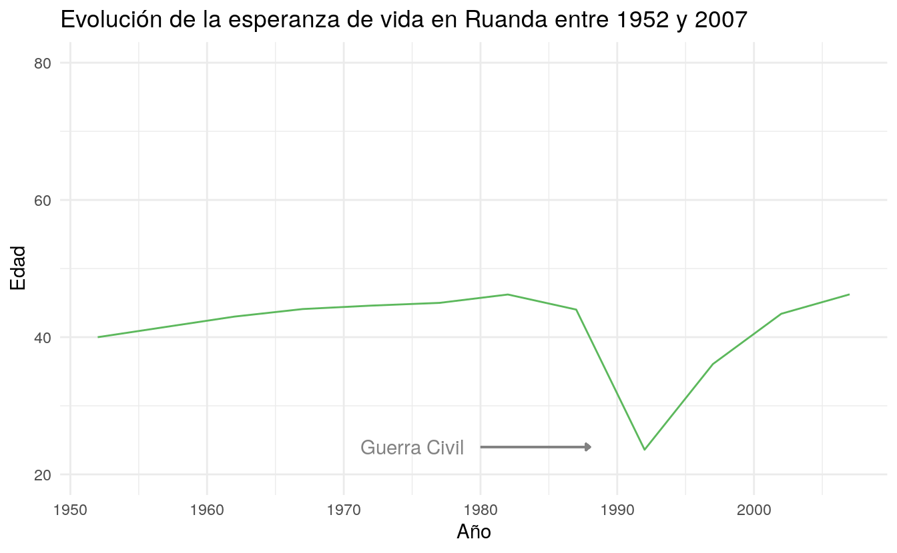

Veamos otras opciones para ajustar la flecha. En esta ocasión tendremos que modificar el valor de `ends` que viene por defecto


```r
  grafico +
    geom_segment(aes(x = 1992.5, xend = 1995, y = 30, yend = 50), arrow = arrow(angle = 40, length = unit(0.2, "cm"), ends = "first", type = "open"), colour = "gray51") +
  annotate("text", x = 1995, y = 52, label = "Guerra Civil", colour = "gray51")
```

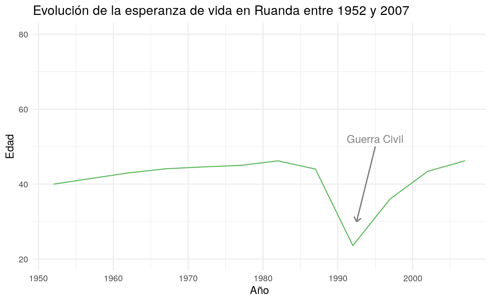


</div>

## 28.4 Escalas{-#escalas}

### 28.4.4 Ejercicios{-#ejercicios-2844}

1. ¿Por qué el siguiente código no reemplaza la escala predeterminada?


```r

df <- tibble(
  x = rnorm(10000),
  y = rnorm(10000)
)

ggplot(df, aes(x, y)) +
  geom_hex() +
  scale_colour_gradient(low = "white", high = "red") +
  coord_fixed()
```

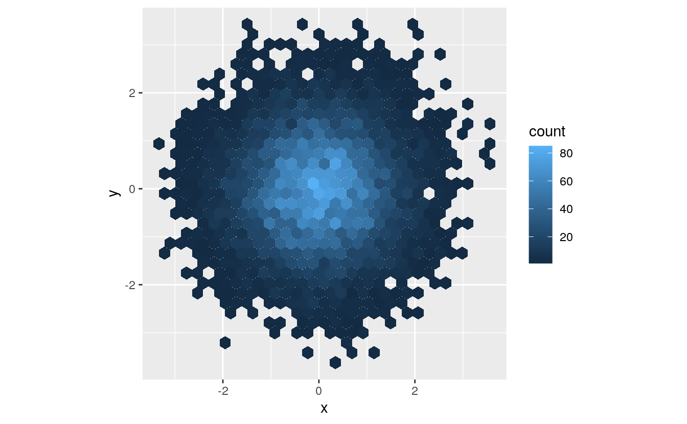
<div class="solucion">
<h3>Solución</h3>

La escala predeterminada no se ve modificada porque en el caso de `geom_hex()` tenemos que utilizar `scale_fill_gradient()`:

```r
ggplot(df, aes(x, y)) +
  geom_hex() +
  scale_fill_gradient(low = "white", high = "red") +
  coord_fixed()
```


</div>

2. ¿Cuál es el primer argumento para cada escala? ¿Cómo se compara con `labs()`?

<div class="solucion">
<h3>Solución</h3>

</div>

3. Cambia la visualización de los periodos presidenciales (`datos::presidencial`) de las siguientes maneras:

I.	Combinando las dos variantes que se muestran arriba.
II.	Mejorando la visualización del eje y.
III.	Etiquetando cada término con el nombre del presidente.
IV.	Agregando etiquetas informativas al gráfico.
V.	Poniendo intervalos de 4 años (¡esto es más complicado de lo que parece!).

<div class="solucion">
<h3>Solución</h3>

Las dos versiones a las que hace alusión el punto I son las siguientes:


```r
presidencial %>%
  mutate(id = 33 + row_number()) %>%
  ggplot(aes(inicio, id)) +
  geom_point() +
  geom_segment(aes(xend = fin, yend = id)) +
  scale_x_date(NULL, breaks = presidencial$inicio, date_labels = "'%y")


presidencial %>%
  mutate(id = 33 + row_number()) %>%
  ggplot(aes(inicio, id, colour = partido)) +
  geom_point() +
  geom_segment(aes(xend = fin, yend = id)) +
  scale_colour_manual(values = c(Republicano = "red", `Demócrata` = "blue"))
```

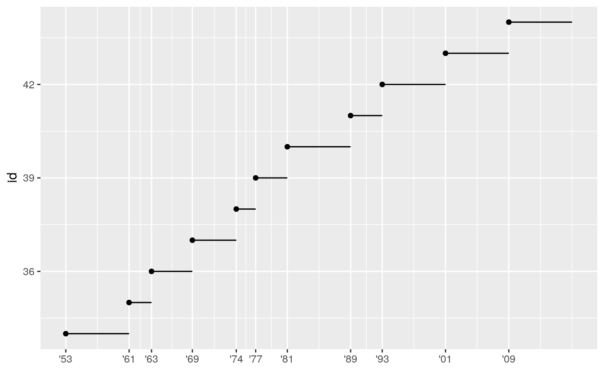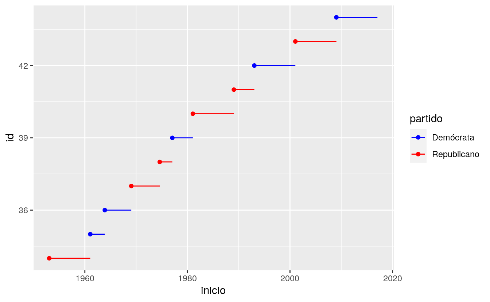

Primero, combinémoslas:


```r

presidencial %>%
  mutate(id = 33 + row_number()) %>%
  ggplot(aes(inicio, id, colour = partido)) +
  geom_point() +
   scale_x_date(NULL, breaks = presidencial$inicio, date_labels = "'%y") +
  geom_segment(aes(xend = fin, yend = id)) +
  scale_colour_manual(values = c(Republicano = "red", `Demócrata` = "blue"))
```

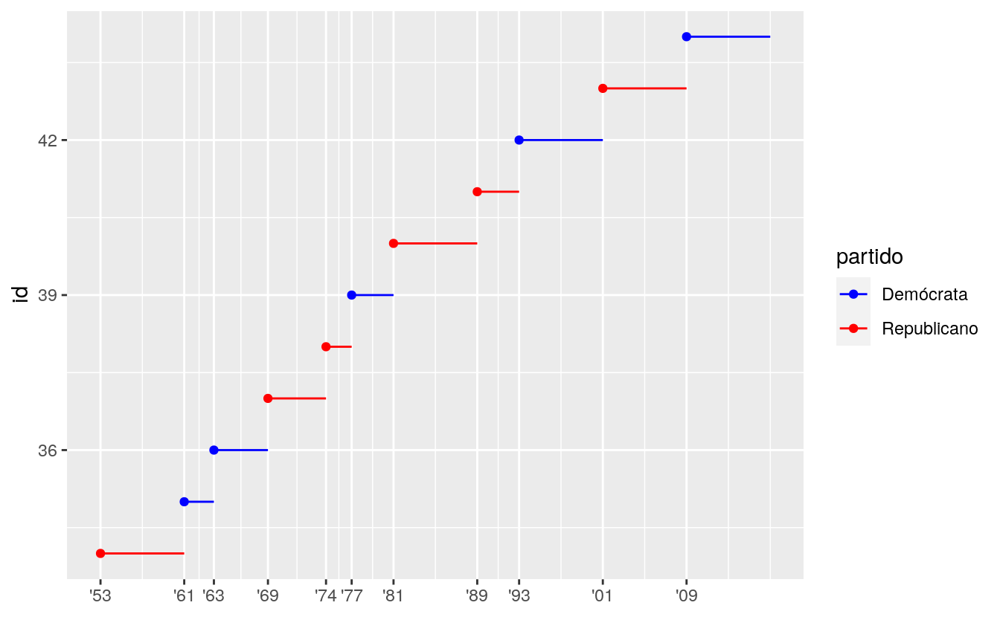

Listo. Ahora, mejoremos la visualización del eje `y`, como indica el punto II. El eje `y` indica a qué número de mandatario corresponde (el dataset va desde Eisenhower, el presidente número 34, a Obama, el número 44). Lo ideal sería que en el eje `y` apareciera cada mandatario. Para que mantenga el orden de aparición, utilizaremos `fct_inorder()`. Como hay dos presidentes distintos que comparten apellido, podemos agregar el `id` al nombre para que distinga entre el que fue el presindente 41° y el que fue 43°.


```r
presidencial %>%
  mutate(id = 33 + row_number()) %>%
  mutate(nombre = fct_inorder(str_c(nombre," (", id, "°)"))) %>% 
  ggplot(aes(inicio, nombre, colour = partido)) +
  geom_point() +
   scale_x_date(NULL, breaks = presidencial$inicio, date_labels = "'%y") +
  geom_segment(aes(xend = fin, yend = nombre)) +
  scale_colour_manual(values = c(Republicano = "red", `Demócrata` = "blue"))
```

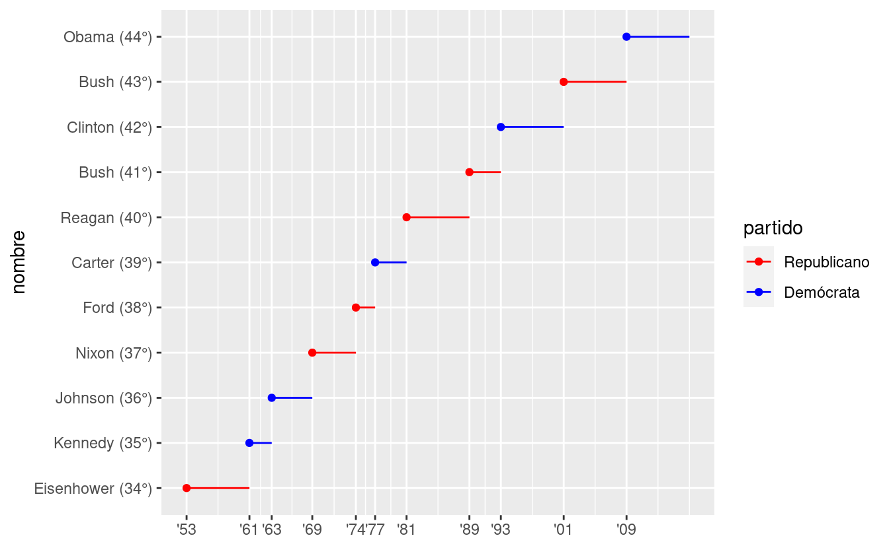

El punto III y IV hacen referencia a las etiquetas. En el paso anterior ya etiquetamos cada periodo presidencial con el nombre del mandatario. Agregar etiquetas al `y` sería un poco redundante (y lo será más cuando le pongamos título al gráfico). La del eje `x` se infiere, así que no agregaremos nada. 


```r
presidencial %>%
  mutate(id = 33 + row_number()) %>%
  mutate(nombre = fct_inorder(str_c(nombre," (", id, "°)"))) %>% 
  ggplot(aes(inicio, nombre, colour = partido)) +
  geom_point() +
   scale_x_date(NULL, breaks = presidencial$inicio, date_labels = "'%y") +
  geom_segment(aes(xend = fin, yend = nombre)) +
  scale_colour_manual(values = c(Republicano = "red", `Demócrata` = "blue")) +
  labs(title = "Presidentes de EE. UU. entre 1953 y 2017",
       y = NULL)
```

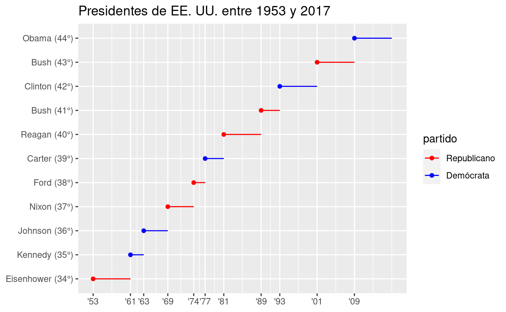

Por último, tenemos que agregar intervalos de 4 años, que es lo que dura un período presidencial, así será posible ver quiénes estuvieron más de un período y quiénes no completaron el tiempo esperado. Para ello, usaremos el argumento `date_minor_breaks` dentro de `scale_x_date()`, que nos permite indicar intervalos con palabras (en este caso, "4 years"). 


```r
presidencial %>%
  mutate(id = 33 + row_number()) %>%
  mutate(nombre = fct_inorder(str_c(nombre," (", id, "°)"))) %>% 
  ggplot(aes(inicio, nombre, colour = partido)) +
  geom_point() +
   scale_x_date(NULL, breaks = presidencial$inicio, date_labels = "'%y", date_minor_breaks = "4 years") +
  geom_segment(aes(xend = fin, yend = nombre)) +
  scale_colour_manual(values = c(Republicano = "red", `Demócrata` = "blue")) +
  labs(title = "Presidentes de EE. UU. entre 1953 y 2017",
       y = NULL)
```

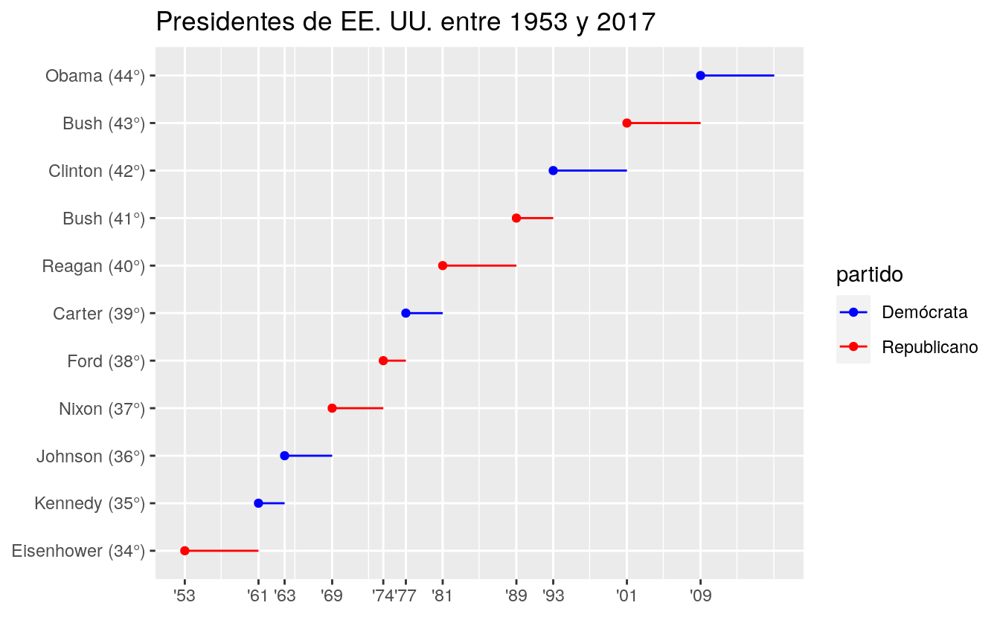

¡Listo!
</div>

4. Utiliza `override.aes` para que la leyenda en el siguiente gráfico sea más fácil de ver:


```r
ggplot(diamantes, aes(quilate, precio)) +
  geom_point(aes(colour = corte), alpha = 1 / 20)
```

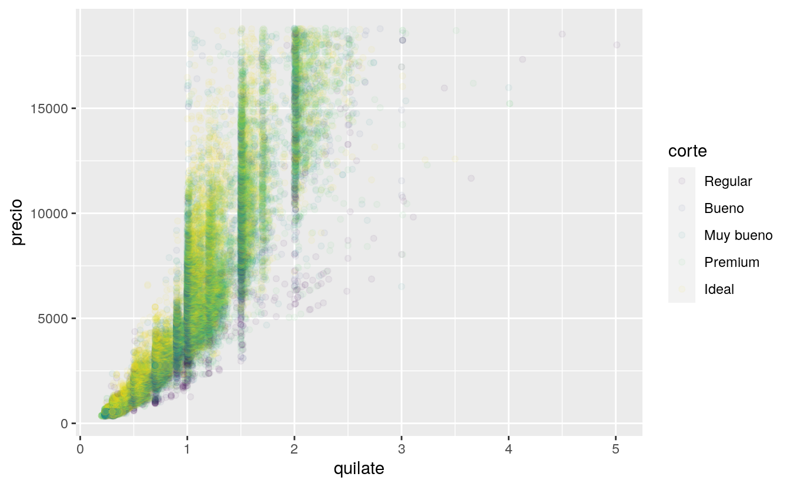
<div class="solucion">
<h3>Solución</h3>

El problema con estas etiquetas es que quedaron transparentes al haber utilizado `alpha` para ajustar la transparencia de los puntos. Si usamos `override.aes` al ajustar los parámetros de la leyenda podemos hacer que en ella los colores no sean transparentes. 


```r
ggplot(diamantes, aes(quilate, precio)) +
  geom_point(aes(colour = corte), alpha = 1 / 20) +
  guides(colour = guide_legend(override.aes = list(alpha = 1)))
```

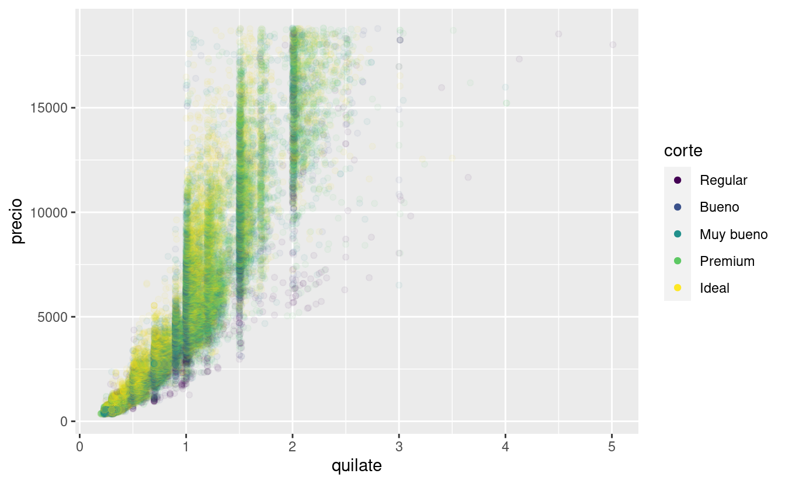

</div>
